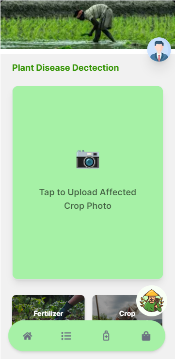
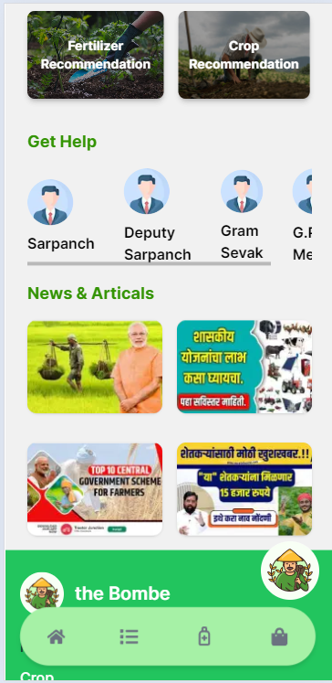
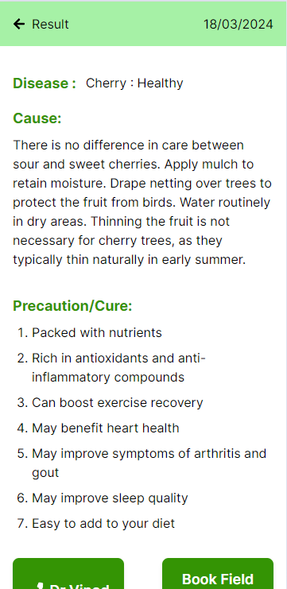
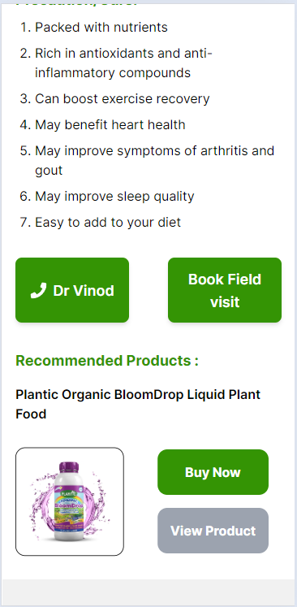
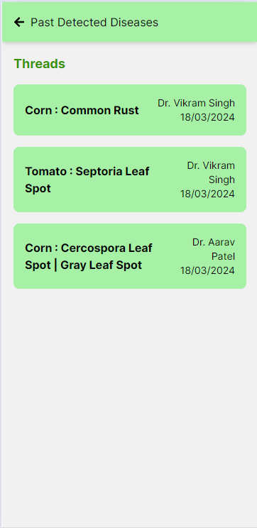
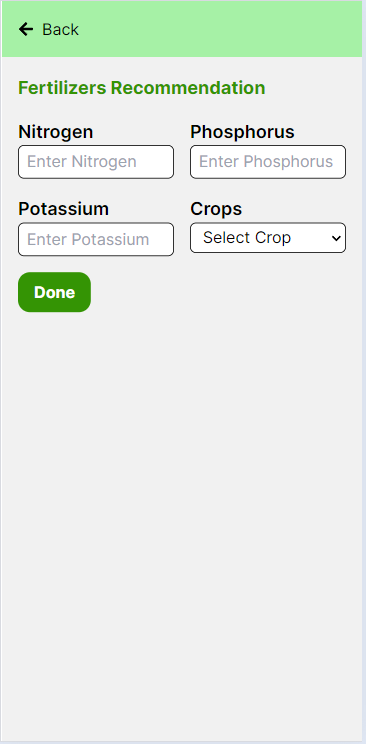
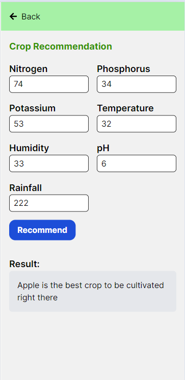
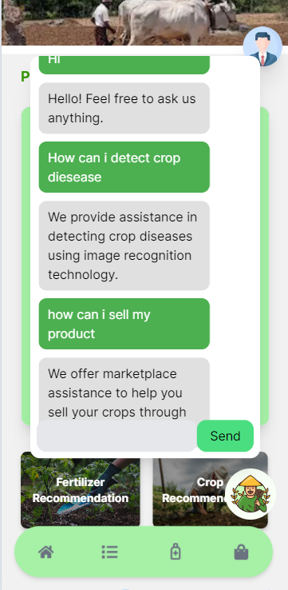
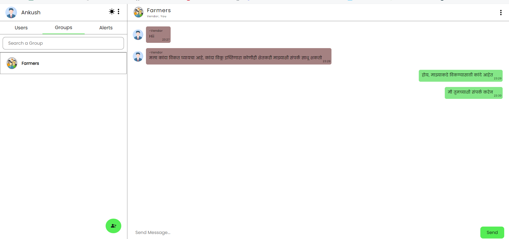
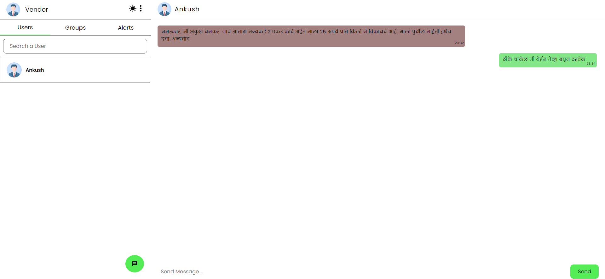

# Farm - Buddy

Farm - Buddy is a mobile-friendly application designed to assist farmers in diagnosing crop diseases, providing fertilizer recommendations, connecting with local doctors, receiving crop recommendations based on weather data, accessing a marketplace, and getting assistance through a chatbot for agricultural queries.

## Technologies Used

- Next.js: A React framework for frontend development.
- Express.js: A Node.js web application framework for backend development.
- Flask: A micro web framework for Python used for backend services.
- Convolutional Neural Network (CNN): Used for crop disease detection.
- Random Forest: Utilized for crop recommendation based on weather features.

## Features

1. **Crop Disease Detection and Remedial Fertilizer Recommendation**
   - Utilizes CNN for accurate crop disease detection from images
   - Provides remedial fertilizer recommendations based on disease diagnosis

2. **Connects Farmers with Local Doctors**
   - Features a location-based service to connect farmers with nearby healthcare professionals

3. **Crop Recommendation System**
   - Uses weather features and a Random Forest model to suggest crops suitable for specific conditions

4. **Fertilizer Recommendation System with Precautionary Measures**
   - Offers fertilizer recommendations along with precautionary measures and cures for common crop issues

5. **Marketplace for Farmers**
   - Provides a platform for farmers to buy/sell agricultural products

6. **Chatbot for Queries**
   - Includes a chatbot feature for farmers to get answers to disease-related, agriculture-related, and marketplace queries

## Preview

